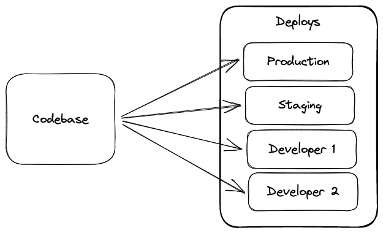

# [Codebase](https://12factor.net/codebase)

::: tip ***One codebase tracked in revision control, many deploys***
The relationship between the app and the codebase should be one-to-one, but the relationship between the codebase and deployments can be one-to-many.
:::
 

{ style="display: block; margin: 0 auto" }

## Tracked in a version control system

*A twelve-factor app is always tracked in a version control system* (Git, Mercurial, Subversion). The copy of the revision in the tracking database is the ***code repository***.

A **codebase** is any single repo when using SVN or any set of repositories who share a root commit when using Git.([Differences between SVN and Git](https://odsc.medium.com/git-vs-svn-whats-the-difference-2c7072f7679f)).

## One-to-one correlation between codebase and app

- If there are multiple codebases, it is considered a ***distributed system***. Each component is itself an app that can comply with twelve-factor.
  For example, in microservice architectures, the solution comprises more than one service with its codebase. Each of them is considered an app.

- If multiple apps share the same code, they must use shared libraries. **Sharing the same code across apps violates twelve-factor.**

## Many deploys of the same codebase

*A ***deploy*** is a running instance of the app*. While there is only one codebase per app, there can be many deploys of the app. Typically, there is production deploy and one or more staging deploys.
The copy that each developer runs in their local environment **also counts as a deploy**.
