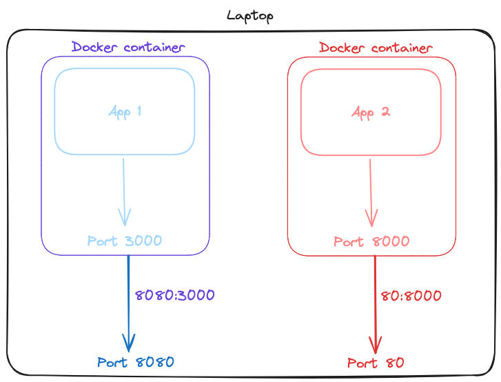

# [Port Binding](https://12factor.net/port-binding)

::: tip ***The application must expose its functionality on an HTTP port***
The environment provides the network, host, and port on which the app declares it will listen for requests. The application, in turn, must have its own server installed and declared as a dependency such as [Fastify](https://fastify.dev/) for javascript or [FastAPI](https://fastapi.tiangolo.com/) for Python, without relying on runtime injection of a web server into the execution environment. This allows the app to be **completely self-contained** and connections between apps to be controlled external to the code.

:::
 

){ style="display: block; margin: 0 auto" }

Port binding is the best way to expose a process to the network. Several servers and utilities expose their services through port binding, and it is common for them to have a default port number that is well known, which can be overwritten by the user. Some of the best known are the following:

- HTTP (like Nginx or Apache): ports 80 and 443.
- SSH (OpenSSH): port 22.
- MongoDb satabases: 27017.
- Redis servers: 6379.

Port binding allows processes to act as [backing services](./04-backing-services.md) for other processes if needed.

A straightforward illustration might involve an application exposing port 8000, running in a Docker container that assigns that port. After deployment, the container makes public the port to which it will be mapped, such as port 80, for instance.
