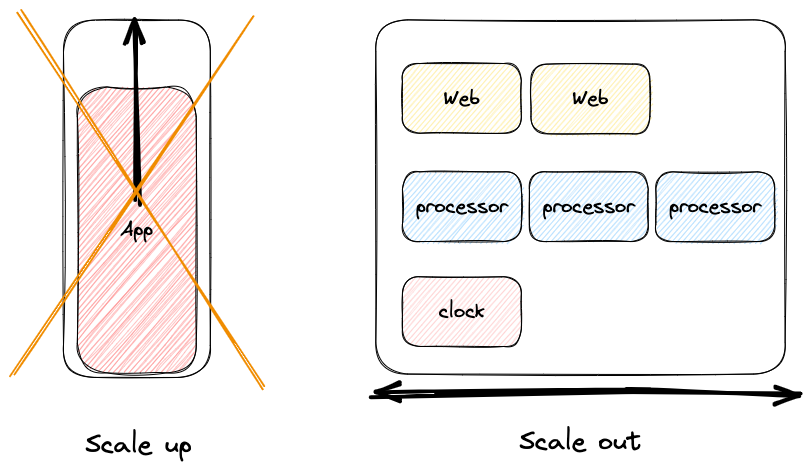

# [Concurrency](https://12factor.net/concurrency)

::: tip ***Design applications for scalability by using the process model***
An app could have one large and complex process handling all the logic, perhaps running sub-tasks in separate threads. Following the concurrency principle, it must be the other way around. Workloads should be split and grouped by type, and all of them together make up the major task the app has to cope with.
:::
 

{ style="display: block; margin: 0 auto" }

## Scale efficiently

**Scaling out instead of scaling up**. Having different processes dealing with different tasks means that more instances can be added to handle more workload when required, but *only where necessary*. The other processes remain untouched and, as a result, resources are spent efficiently. If an app doesn’t follow this principle, there’s no other option but to add more computing capacity to the same instance to increase the throughput. Resources would be wasted because they are not strictly applied to the bottleneck but to the entire app.

## Prevent limitations

There is an upper limit to a big single machine running the app when it comes to scaling-up. It’s not possible to add as much capacity as you want in this scenario, which implies that you are constrained to the limit of your hardware. With separate processes running on different instances, it’s possible to *scale out adding more* and more to meet demand and **overcome hardware limitations**. In cloud platforms, this limit could be as high as you want.

## Trust the manager

**Avoid using PIDs and daemons** because they can only run in one machine and have no knowledge of what happens on other instances. The app should not manage how its scales or restarts. *The manager is the one dealing with instances*, when and how they scale, restart or shut down. These can be system operation managers such as [launchd](https://www.launchd.info/), [Kubernetes control plane](https://kubernetes.io/docs/concepts/overview/components/) or cloud services like [EC2](https://docs.aws.amazon.com/AWSEC2/latest/UserGuide/concepts.html).
