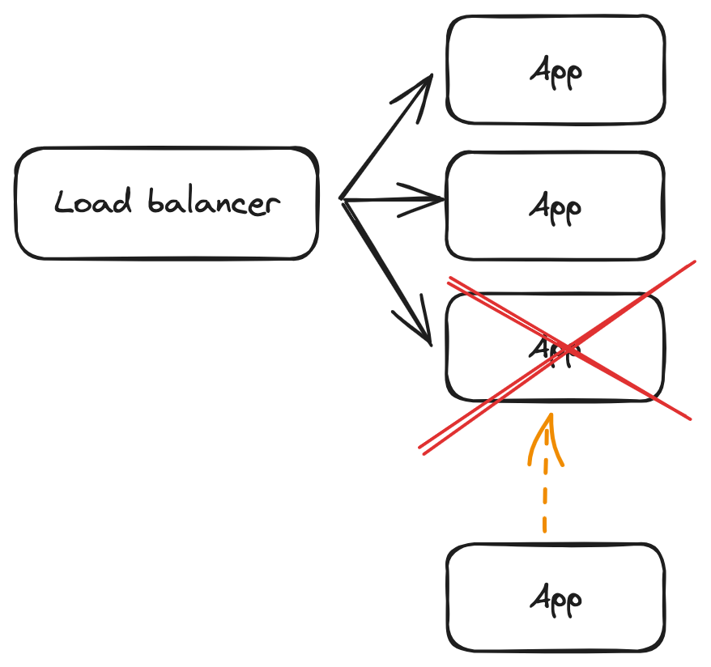

# [Disposability](https://12factor.net/disposability)

::: tip ***Maximize robustness with fast startup and graceful shutdown***
An app should be stopped gracefully at any time without losing data or causing disruptions. It should also start up fast.
:::
 

{ style="display: block; margin: 0 auto" }

In a resilience and robust system that scales dynamically, an app has to be replaceable fast and easily. I must therefore be able to handle a ``SIGTERM``, completing running processes and freeing the resources as quick as possible. In the same way, the start-up of the app should be equally fast and completed as soon as possible.

## Reduce the potential downtime between updating or scaling events

This means new instances should be started, traffic gradually shifted, and old instances gracefully terminated without interruptions. Too slow a response to a health check at end or start could lead to alerts and deployment failures in certain systems.
  
## Avoid losing critical data

Applications that handle shutdown well are less likely to leave behind inconsistent or corrupted data in the event of a failure.
  
## Resource allocation

Database connections, network connections, process capacity and such must be freed orderly in order to prevent resource leaks and availability for other instances.
  
## Prevent abruptly interruptions

In a user-facing apps an app could die in the middle of a user interaction, leading to a bad user experience. A graceful shutdown should be able to handle this scenario and let another instance complete the task as soon as possible.

## Handle sudden fatality

On a less common scenario of a hardware failure or ``SIGKILL`` signal, the app should be ready for a sudden termination as well. Stateless applications and queues that delays the job until another instance is ready to process it, make a service easily exchangeable without loss of data. For this approach to work, the queue should be either *reentrant*, like transactions, and/ or *idempotent*.

> ### Example
>
> An app subscribed to a message broker, e.g. [Azure service bus](https://azure.microsoft.com/en-us/products/service-bus) running in [Kubernetes](https://kubernetes.io/). At a certain point, the app fails to process a message from the queue and becomes unhealthy.
>
>1. The control plane decides to terminate the pod, which >responds with a fast and **gracefully shutdown** and returns the >resources to the manager.
>2. The message broker received the unlock signal from the app, meaning that the task should go back to the queue until another subscriber is ready to listen.
>3. In turn, the new instance is **started in seconds**.
>4. When ready, it receives the pending message from que queue and process it.
