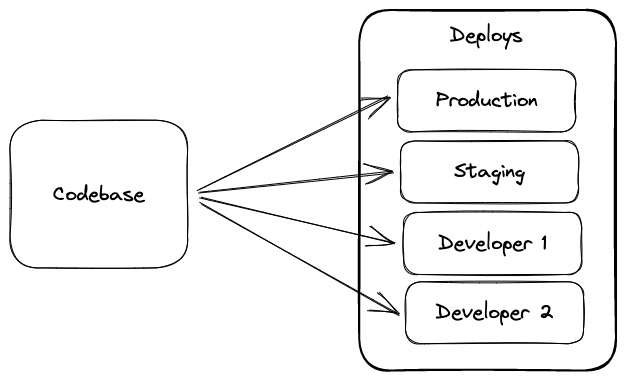

# [Codebase](https://12factor.net/codebase)

::: tip ***One codebase tracked in revision control, many deploys***
There should be a one-to-one relationship between app and codebase, but could be one-to-many relationship between codebase and deployments
:::
   

{ style="display: block; margin: 0 auto" }

## Tracked in a version control system

*"A twelve-factor app is always tracked in a version control system"* (Git, Mercurial, Subversion). The ***code repository*** is a copy of the revision on the tracking database.

A **codebase** is any single repo when using SVN or any set of repos who share a root commit with Git.([Differences between SVN and Git](https://odsc.medium.com/git-vs-svn-whats-the-difference-2c7072f7679f)).

## One-to-one correlation between codebase and app

- If there are multiple codebases, it is considered a ***distributed system***. Each component is itself an app that can comply with twelve-factor.
As an example, in microservice architectures the solution comprises more than one service with its codebase. Every one of them is considered an app.

- If multiple apps share the same code, they must use shared libraries. ***Sharing the same code across apps is a violation of twelve-factor.*** 

## Many deploys of the same codebase

*"A ***deploy*** is a running instance of the app"*. While there is only one codebase per app, there might be many deploys of the app. Typically, there is production deploy, and one or more staging deploys.
The copy each developer has running in their local environment ***"also qualifies as a deploy"***
