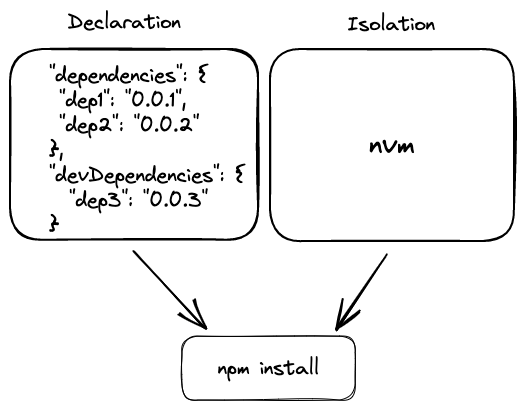

# [Dependencies](https://12factor.net/dependencies)

::: tip ***Explicitly declare and isolate dependencies***
Support libraries must be explicitly declared in a manifest and isolated from the surrounding environment
:::
   

{ style="display: block; margin: 0 auto" }

## Do not rely on implicit system-wide packages

*"A twelve-factor app **never relies on implicit existence of system-wide packages**"*. All dependencies must be declared completely and exactly via a ***dependency declaration** manifest*. It also uses a ***dependency isolation** tool* to ensure no implicit dependencies from the environment.
Regardless of the toolchain, ***dependency declaration and isolation must always be used together – only one or the other is not sufficient to satisfy twelve-factor.***

Developers can declare the app dependencies and let the dependency manager tool ensure that dependencies are satisfied. **So, instead of packaging the third-party libraries inside your microservice, you can specify all dependencies in** the dependencies manifest. 

As an example, in NodeJS we can use **npm** as a package manager to manage the app dependencies. It generates a ``package.json`` file where all the dependencies are explicitly declared with their exact version needed for the project.

## Simplify setup for new developers

New developers to the app can check out the codebase onto their machine and will be able to set up the development environment **requiring only the language runtime and dependency manager installed as prerequisites**. With a command as ``npm install`` they will be able to reproduce the project set up with a deterministic result.

## Do not rely on implicit system tools

Certain system tools, like ``curl``, while may exist on most systems, there is no guarantee they will exist on all system where the app may be deployed, or the version used will be compatible. Therefore, if the app requires a system tool, it must be shipped with the app.
